README.md
# 🛡️ CloudRanger Prime: Autonomous Sentinel


> **"The system that heals itself."**
>
> An autonomous Kubernetes defense agent that detects corrupted financial transactions and neutralizes compromised pods in real-time (< 2s reaction time).

---

## 📸 The "Kill Shot" (Demo)
*(Terminal showing "THREAT DETECTED" -> "TARGET NEUTRALIZED")*

---

## ⚡ Project Overview
**CloudRanger Prime** is a **Self-Healing Infrastructure** demonstration. It simulates a high-frequency financial ledger being attacked by "Poison Data" injection.

Instead of waiting for a human engineer to read logs and restart the server, the **Sentinel Agent**:
1.  **Watches** the live stream of application logs.
2.  **Detects** the specific "Poison Data" signature (Simulated Hack).
3.  **Executes** a `SIGKILL` command via the Kubernetes API.
4.  **Verifies** that the Cluster Auto-Healer spawns a fresh, clean replacement.

**Reaction Time:** < 2 Seconds.
**Human Intervention:** 0.

---

## 🏗️ Architecture

```mermaid
flowchart TB
    %% --- GLOBAL STYLING & CYBERPUNK THEME ---
    style K8S fill:#0d1117,stroke:#30363d,stroke-width:2px,rx:15,ry:15
    style POD fill:#21262d,stroke:#f85149,stroke-width:2px,stroke-dasharray: 5 5,rx:10,ry:10
    style COMMAND fill:#0d1117,stroke:#2ea043,stroke-width:2px,rx:15,ry:15

    classDef app fill:#161b22,stroke:#f85149,stroke-width:2px,color:#f85149
    classDef logs fill:#161b22,stroke:#d29922,stroke-width:2px,color:#e3b341
    classDef api fill:#161b22,stroke:#58a6ff,stroke-width:2px,color:#79c0ff
    classDef healer fill:#161b22,stroke:#2ea043,stroke-width:2px,color:#56d364
    classDef brain fill:#000000,stroke:#3fb950,stroke-width:3px,color:#3fb950
    classDef ui fill:#161b22,stroke:#a371f7,stroke-width:2px,color:#bc8cff

    %% --- INFRASTRUCTURE LAYER ---
    subgraph K8S [☸️ Kubernetes Cluster Environment]
        API[⚙️ K8s API Server]:::api
        RS[🔄 ReplicaSet / Auto-Healer]:::healer
        
        subgraph POD [🚨 Compromised Target Pod]
            APP[🏦 Financial Ledger App <br/> Vulnerable Node]:::app
            STREAM[(📜 stdout / Log Stream)]:::logs
        end
        
        APP -->|Generates Tx| STREAM
        RS -.->|Detects Pod Death & <br/> Respawns Clean Image| APP
        API ==>|Executes SIGKILL| APP
    end

    %% --- CONTROL PLANE LAYER ---
    subgraph COMMAND [🛡️ CloudRanger Command Center]
        AGENT{🤖 Python Sentinel Agent <br/> The Brain}:::brain
        UI[📊 Streamlit UI <br/> Telemetry]:::ui
    end

    %% --- INTER-SYSTEM COMMUNICATION ---
    STREAM -.->|K8s Watch API <br/> Real-time Log Tailing| AGENT
    AGENT ==>|1. Detects 'POISON DATA' ☣️ <br/> 2. Triggers Neutralization| API
    AGENT -->|Pushes Threat Metrics| UI

    %% --- PATHWAY HIGHLIGHTS (COLOR CODING) ---
    %% 0: App to Stream (Standard)
    linkStyle 0 stroke:#8b949e,stroke-width:2px
    %% 1: Healer to App (Green Recovery)
    linkStyle 1 stroke:#2ea043,stroke-width:3px,stroke-dasharray: 5 5,color:#56d364
    %% 2: API to App (Red Kill Execution)
    linkStyle 2 stroke:#f85149,stroke-width:4px,color:#f85149
    %% 3: Stream to Agent (Yellow Monitoring)
    linkStyle 3 stroke:#d29922,stroke-width:2px,stroke-dasharray: 5 5,color:#e3b341
    %% 4: Agent to API (Red Alert Trigger)
    linkStyle 4 stroke:#f85149,stroke-width:3px,color:#f85149
    %% 5: Agent to UI (Purple Telemetry)
    linkStyle 5 stroke:#a371f7,stroke-width:2px,color:#bc8cff
```



---

## 🚀 Technical Stack

| Component | Technology | Role |
|-----------|------------|------|
| **The Victim** | Python + Docker | Simulates a Financial Ledger app with random data corruption. |
| **The Body** | Minikube (K8s) | Hosts the application in a contained environment. |
| **The Brain** | Python (K8s Client) | The "Sentinel" that monitors and kills pods. |
| **The Eyes** | Streamlit | (Optional) Real-time dashboard for threat metrics. |

---

## 🛠️ Installation & Setup

### Prerequisites
* Docker & Minikube
* Python 3.x
* `pip install kubernetes streamlit`

### 1. Launch the Cluster
```bash
minikube start
eval \$(minikube docker-env)
```

### 2. Deploy the "Victim" (Financial Node)
```bash
# Build the image inside the cluster
docker build -t financial-node:v1 src/financial-node/

# Deploy to Kubernetes
kubectl run financial-ledger --image=financial-node:v1 --image-pull-policy=Never --labels="run=financial-ledger"
```

### 3. Activate the Sentinel
```bash
python3 src/agent/sentinel.py
```

---

## 🖥️ The Code Logic (Snippet)

The core logic relies on the Kubernetes `watch` stream to react instantly to log events.

```python
# simplified_sentinel.py
for event in w.stream(v1.list_pod_for_all_namespaces, label_selector="run=financial-ledger"):
    logs = v1.read_namespaced_pod_log(name=pod_name, namespace=namespace)
    
    if "POISON DATA" in logs:
        print(f"🚨 THREAT DETECTED: {pod_name}")
        v1.delete_namespaced_pod(name=pod_name, namespace=namespace)
        print("✅ TARGET NEUTRALIZED.")
```

---

## 🔮 Future Roadmap
- [ ] Integration with **Prometheus** for long-term metric storage.
- [ ] **Slack/Discord Alerts** when a kill occurs.
- [ ] Upgrade to **Deployment** sets for zero-downtime rolling updates.

---

### 👨‍💻 Author
**[Arjo216]**
*Cloud Security & DevOps Enthusiast*
